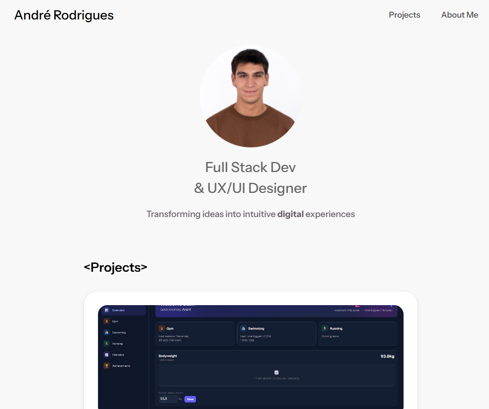

# André Rodrigues — Portfolio

Personal portfolio built with Vue 3 and Tailwind CSS, featuring project case studies, a downloadable CV and a small chatbot that answers questions about me.

**Live site:** https://andrerodrigues884.github.io/Portfolio/



## Features

- **Projects** — cards linking to detail pages with a description, tech stack, live demo and source code links
- **About me** — background, skills and education
- **Chatbot** — ask questions about me; answered by a FastAPI backend
- **CV download** — PDF served from the site
- **Responsive layout** — works on desktop and mobile

## Tech Stack

| Layer    | Technologies                                   |
| -------- | ---------------------------------------------- |
| Frontend | Vue 3 (Composition API), Vue Router, Tailwind CSS, Vite |
| Backend  | Python, FastAPI, pandas                        |
| Hosting  | GitHub Pages                                   |

## Project Structure

```
├── backend/
│   ├── api/server.py        # FastAPI app exposing POST /chat
│   ├── personal_data.csv    # Data the chatbot answers from
│   └── requirements.txt
├── docs/                    # README images
├── public/                  # Static files (CV)
└── src/
    ├── components/          # Header, Footer, ProjectCard, ChatBot
    ├── data/projects.js     # Project content
    ├── router/              # Hash-based routes
    └── views/               # Home, Projects, Project details, About
```

## Getting Started

### Prerequisites

- Node.js 20+
- Python 3.10+ (only for the chatbot)

### Frontend

```bash
npm install
npm run dev
```

The app runs at `http://localhost:5173/Portfolio/`.

### Backend (chatbot)

```bash
python -m venv backend/venv
backend/venv/Scripts/activate        # Windows
# source backend/venv/bin/activate   # macOS / Linux
pip install -r backend/requirements.txt
uvicorn backend.api.server:app --reload --port 8000
```

On Windows, `npm run dev:all` starts the frontend and backend together.

The frontend calls the API at `VITE_API_URL`, falling back to `http://localhost:8000`. To point it elsewhere, create a `.env` file:

```
VITE_API_URL=https://your-api-url
```

## Deployment

```bash
npm run build
npm run deploy
```

This publishes the `dist` folder to the `gh-pages` branch, which GitHub Pages serves.

## Adding a Project

Add an entry to [`src/data/projects.js`](src/data/projects.js). Keep the `slug` lowercase — it is used in the URL (`/#/projects/<slug>`).

## Contact

- GitHub: [@AndreRodrigues884](https://github.com/AndreRodrigues884)
